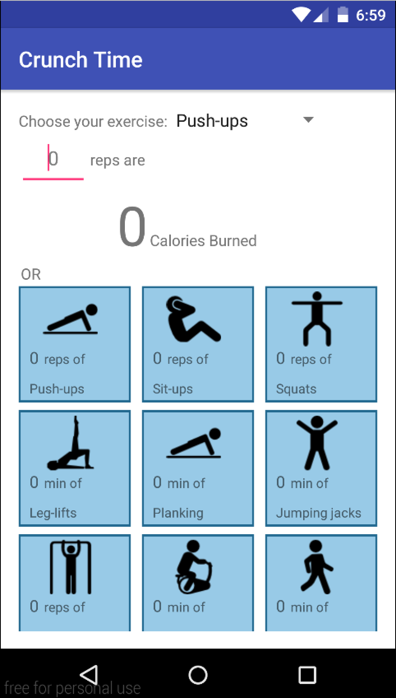
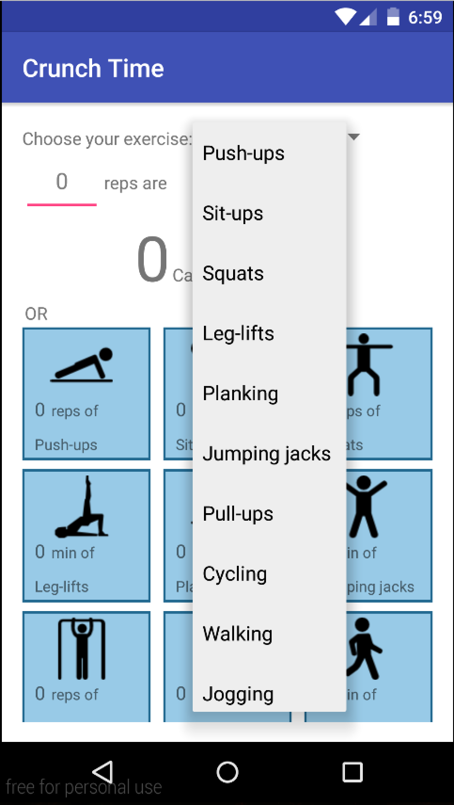
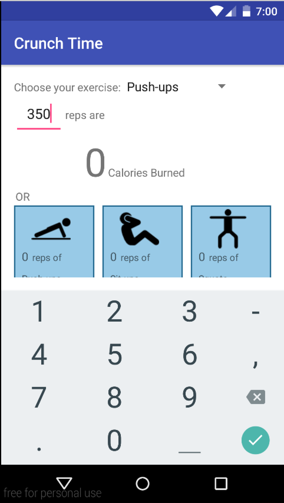
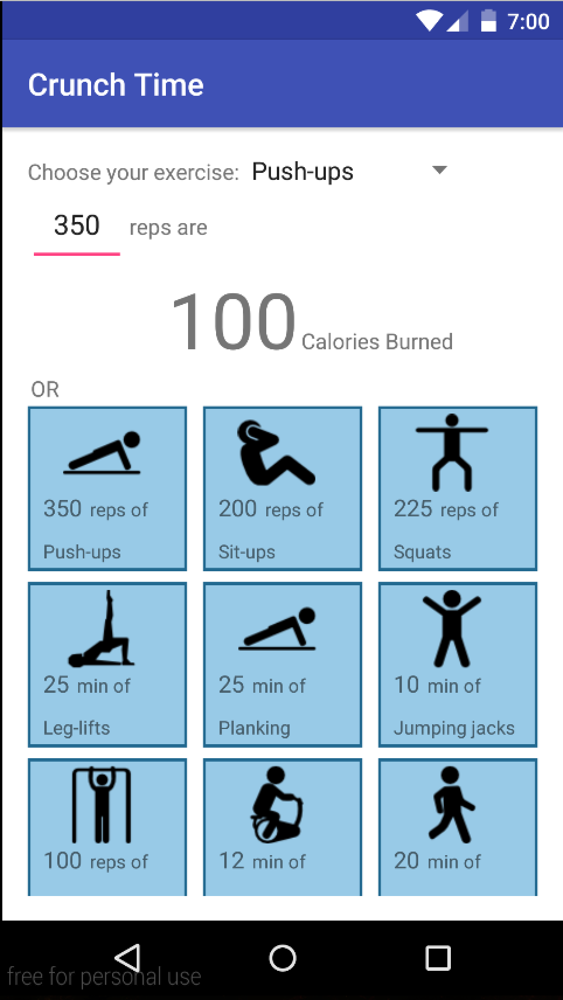

# PROG 01: Crunch Time

Crunch Time is an application designed for the average person curious about how many calories they are burning whenever they exercise. It allows the user to input how much exercise they have done and see the corresponding number of calories burned. In addition, it also displays the equivalent number of reps or minutes needed to burn the same number of calories for all the other exercises.

## Authors

Elena Ouyang ([elena.ouyang@berkeley.edu](mailto:elena.ouyang@berkeley.edu))

## Demo Video

See the [Crunch Time demo] (https://vimeo.com/154378299) here

## Screenshots

## Acknowledgments

* Thank you to Freepik for the icons used within the application
* Icon made by Freepik from www.flaticon.com

*Feel free to enhance your README. For Markdown syntax, see [the GitHub Guides](https://guides.github.com/features/mastering-markdown/). Remove this line in your submission.*
